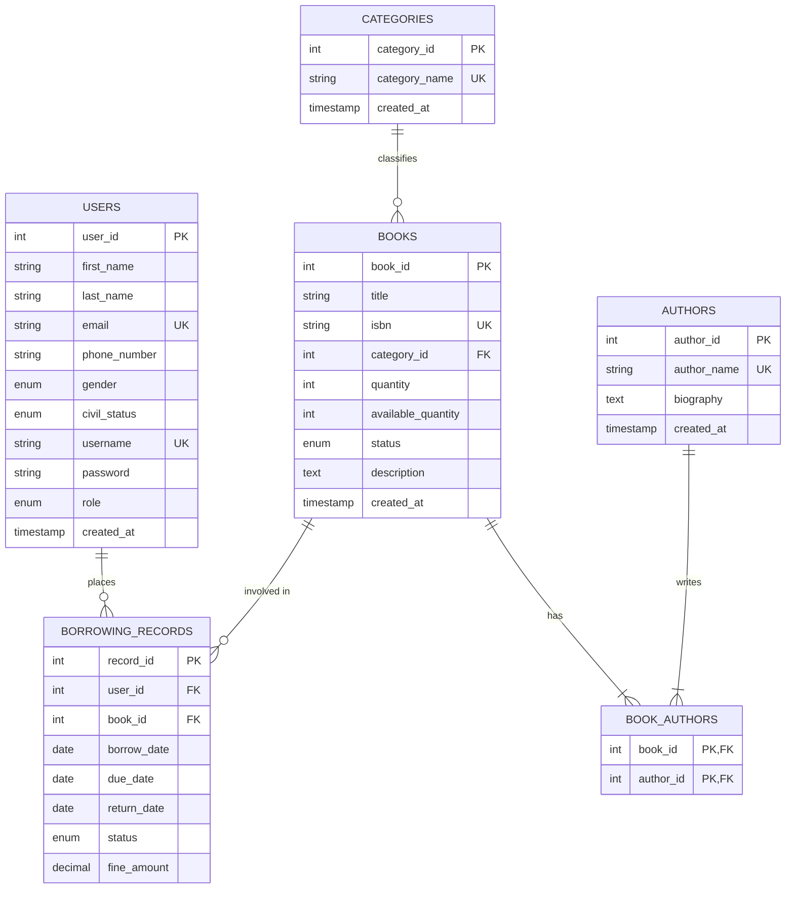

# Entity Relationship Model (ERM) - LibroTech

This diagram represents the visual structure of the **LibroTech** database, showing how users, books, and borrowing records interact.

### Key Relationship Definitions:
*   **One-to-Many (1:N)**: 
    *   One **Category** can contain many **Books**.
    *   One **User** can have multiple **Borrowing Records**.
    *   One **Book** can appear in multiple **Borrowing Records** (over time).
*   **Many-to-Many (M:N)**:
    *   **Books** and **Authors** share a many-to-many relationship, resolved via the `book_authors` junction table. This allows one book to have multiple authors and one author to write multiple books.
