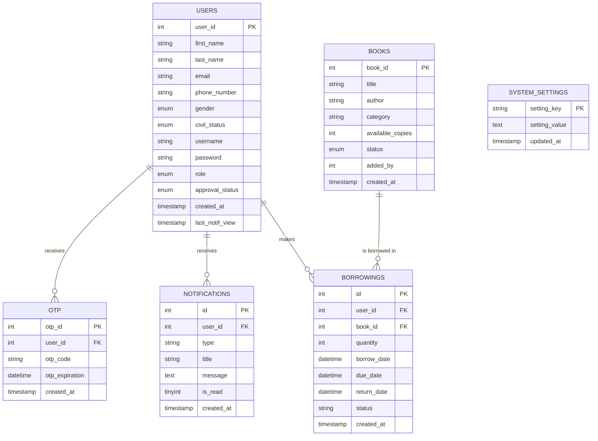

# Entity-Relationship Model (ERM) - Libro Tech Database

This diagram represents the structure and relationships of the `libro_tech_db` database.

## ER Diagram

## Table Descriptions

### USERS
Stores information about librarians and students. Sensitive data (names, emails) is stored in an encrypted format.

### BOOKS
The library catalog containing book details, categories, and availability status.

### BORROWINGS
Tracks book transactions. It links users and books, storing dates for borrowing, due dates, and actual returns.

### NOTIFICATIONS
A system for sending reminders and news alerts to users.

### OTP
Stores one-time passwords for user verification and security.

### SYSTEM_SETTINGS
A key-value store for global application configurations (e.g., library name, borrow limits).
