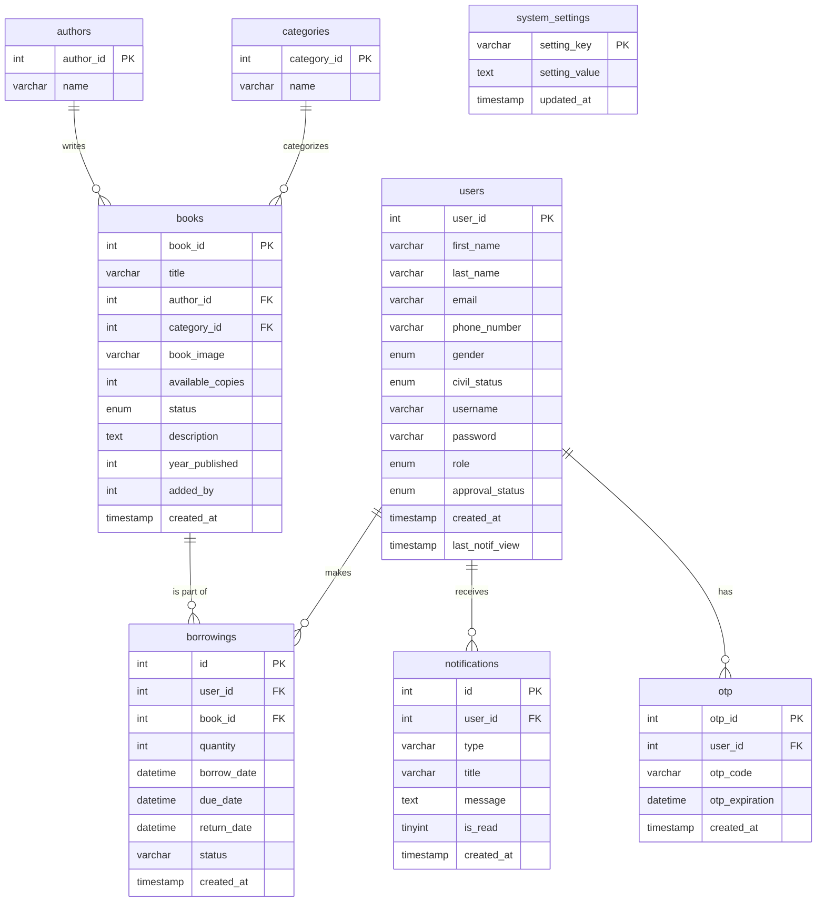

# LibroTech Library Management System - ERM Diagram

This Entity-Relationship Diagram represents the fully normalized (3NF) database schema based on `database.sql`.

```mermaid
erDiagram
    %% By ordering the relationships from the outer edges (authors/categories) 
    %% inwards to the center (borrowings) and then out to the other edge (users),
    %% Mermaid's layout engine can often draw it without crossed lines.
    
    authors ||--o{ books : "writes"
    categories ||--o{ books : "categorizes"
    
    books ||--o{ borrowings : "is part of"
    users ||--o{ borrowings : "makes"
    
    users ||--o{ notifications : "receives"
    users ||--o{ otp : "has"

    authors {
        int author_id PK
        varchar name
    }

    categories {
        int category_id PK
        varchar name
    }

    books {
        int book_id PK
        varchar title
        int author_id FK
        int category_id FK
        varchar book_image
        int available_copies
        enum status
        text description
        int year_published
        int added_by
        timestamp created_at
    }

    borrowings {
        int id PK
        int user_id FK
        int book_id FK
        int quantity
        datetime borrow_date
        datetime due_date
        datetime return_date
        varchar status
        timestamp created_at
    }

    users {
        int user_id PK
        varchar first_name
        varchar last_name
        varchar email
        varchar phone_number
        enum gender
        enum civil_status
        varchar username
        varchar password
        enum role
        enum approval_status
        timestamp created_at
        timestamp last_notif_view
    }

    notifications {
        int id PK
        int user_id FK
        varchar type
        varchar title
        text message
        tinyint is_read
        timestamp created_at
    }

    otp {
        int otp_id PK
        int user_id FK
        varchar otp_code
        datetime otp_expiration
        timestamp created_at
    }

    system_settings {
        varchar setting_key PK
        text setting_value
        timestamp updated_at
    }
```
