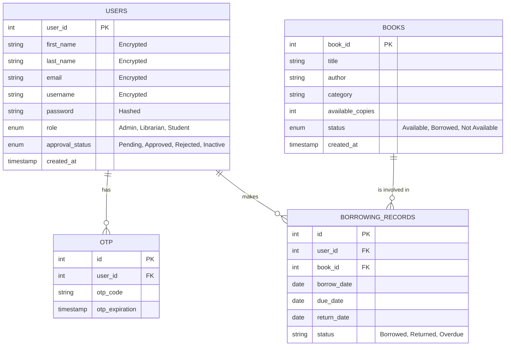

# Database ERM & Role Permissions

This document outlines the database structure and the role-based access control (RBAC) permissions for the **LibroTech Library Management System**.

## 1. Entity Relationship Diagram (ERM)

## 2. Role Permissions Matrix

| Feature | Admin | Librarian | Student |
| :--- | :---: | :---: | :---: |
| **Manage Users** (Approve/Reject/Delete) | ✅ | ❌ | ❌ |
| **Manage Books** (Add/Edit/Delete) | ✅ | ✅ | ❌ |
| **Search & Browse Books** | ✅ | ✅ | ✅ |
| **Borrow/Return Books** | ✅ | ✅ | ❌ |
| **View Own History** | ✅ | ✅ | ✅ |
| **System-wide Reports** | ✅ | ✅ | ❌ |
| **System Settings** | ✅ | ❌ | ❌ |
| **Audit Logs/Activity** | ✅ | ❌ | ❌ |

---

## 3. Permission Details

### 🛡️ Administrator (Admin)
The Admin is the "Superuser" with absolute control over the system.
- **Account Governance**: Only the Admin can approve or reject registration requests.
- **System Security**: Can deactivate or permanently delete accounts.
- **Global Visibility**: Full access to all system-wide statistics and activity logs.

### 📚 Librarian
The Librarian focuses on day-to-day library operations.
- **Inventory Management**: Full CRUD (Create, Read, Update, Delete) permissions for the book collection.
- **Circulation Control**: Manages the borrowing and returning process for students.
- **Operational Reports**: Can view reports related to book popularity and overdue items.

### 🎓 Student
The Student is a consumer of the library services.
- **Resource Access**: Can search and browse the entire book catalog.
- **Personal Dashboard**: Can view their own borrowing history and the status of their current loans.
- **Account Management**: Limited to viewing their own profile and registration status.
