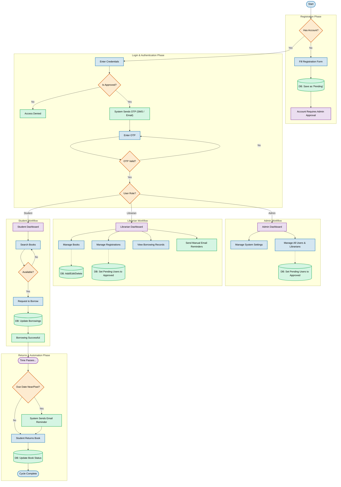

# LibroTech Library Management System - Core Flowchart

This flowchart visualizes the primary user journeys within the application, encompassing Registration, Login (with OTP), and the respective Admin, Librarian, and Student workflows.

